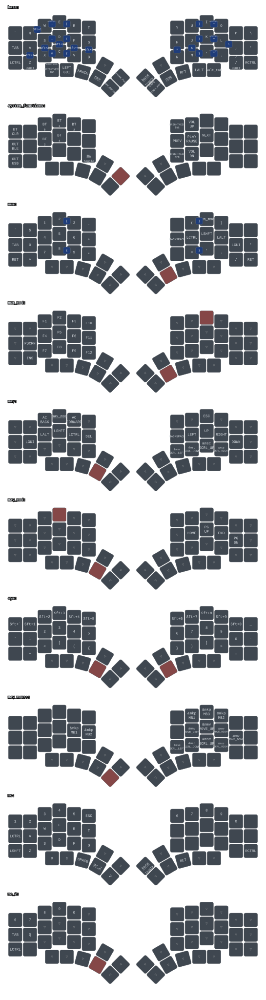

# my map

I currently main the Kyria (revision 3) from SplitKB.
This is the keymap that I use.

- QWERTY
- combos for accessible symbols on base layer, progrmaming-orinted
- overloaded `z` and `/` for accessible shift
- number-pad-like numeric layout
- navigation and modifiers keys on homerow
- minimal tap-hold behavior (no homerow mods) as they're extremely inconsistent

[keymap-drawer](https://github.com/caksoylar/keymap-drawer) render:

